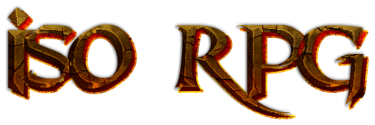

##Features
* Isometric view of the game world
* Dynamic Lighting?
* D&D style combat
* Several boss fights ...
* bla bla bla


##How to compile

####Windows
* [Install JsonCPP](https://docs.google.com/presentation/d/1j8LEDLVJjfNGwIVoKG8jvTNS_pV6ClRKx-tVeHcrEdw/edit?rm=embedded#slide=id.g120670dfdc_0_47)
* [Install SFML](https://docs.google.com/presentation/d/1Xdg4UL_RvcjkVVTskfg-_Tsfl8aEl-pFQlUTEJNbBrU/edit?rm=embedded#slide=id.g120670dfdc_0_47)
* Set working directory to project root
* Add Cmake flags:
```
-DCMAKE_CXX_FLAGS="
-IC:/dev/libs/SFML/include 
-IC:/dev/libs/jsoncpp/include 
-LC:/dev/libs/SFML/lib 
-LC:/dev/libs/jsoncpp/lib"
```

####Linux
* sudo apt-get install libsfml-dev libjsoncpp-dev
* Set working directory to project root

##Used libraries
* **SFML** is used for window handling, rendering and sound
* **JsonCPP** is used for loading tiled maps


##Gameart

####(Credit artists)


##Music and sounds

####(Credit artists)
